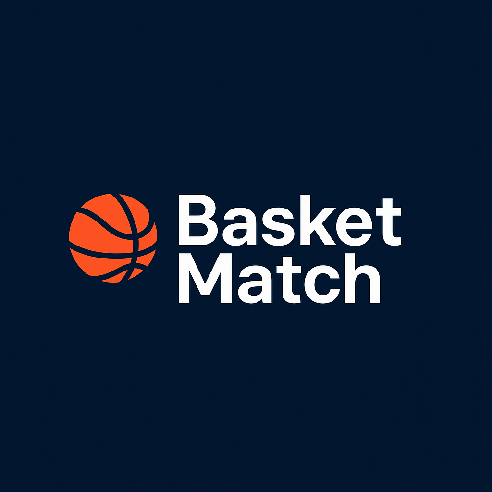

# 🏀 BasketMatch - Executive Pitch
## Profesionalizando el básquet amateur en Montevideo

---

## 🎯 Oportunidad de Mercado

### El problema no resuelto
- **Miles de jugadores amateur** en Montevideo sin solución organizada
- **3+ horas semanales** perdidas organizando cada partido
- **"Trabajo de hormiga"**: confirmar jugadores, reservar cancha, manejar pagos
- **40% de cancelaciones** por problemas logísticos
- **Burnout del organizador**: siempre la misma persona hace todo el trabajo
- **Abandono del deporte** por frustraciones evitables

### Problemas con la oferta actual (campeonatos):
- 📅 **Inflexibilidad**: Día fijo semanal, compromiso de temporada completa
- ⏱️ **Poco tiempo de juego**: En planteles de 10, jugás solo 15-20 min
- 🎯 **Falta de opciones**: O campeonato formal o nada organizado
- 💸 **Alto costo de oportunidad**: Perdés fecha completa si no podés ir

### Market size
- **~5,000 jugadores amateur** activos en Montevideo
- **Mercado total direccionable**: $21M UYU/año
- **Mercado alcanzable**: $5.2M UYU/año (25% penetración)

---

## 💡 Nuestra Solución

### BasketMatch: El "Uber del básquet amateur"

**One-liner**: *Conectamos jugadores amateur con partidos organizados mediante suscripción, garantizando experiencia premium sin logística.*

### Propuesta de valor única:
- 🔄 **Flexibilidad total** - jugás cuando querés
- 🤝 **Ambiente garantizado** - nivel parejo + moderación profesional  
- 🧠 **Cero logística** - nosotros nos encargamos de todo
- 📱 **Tecnología simple** - booking y pagos automáticos
- 🎽 **Servicio completo** - cancha, árbitro, equipamiento
- ⚡ **Eliminamos el "trabajo de hormiga"** - confirmar, reservar, cobrar

---

## 📊 Modelo de Negocio Validado

### Planes de Monetización

#### 🎟️ Partido Individual
- **Precio por jugador**: $350 UYU
- **Target**: Usuarios ocasionales, nuevos usuarios
- **Beneficios**: Acceso completo al servicio sin compromiso

#### 💳 Suscripciones Mensuales
- **Plan Casual (4 partidos/mes)**: $1.200 UYU (15% descuento) - $300/partido
- **Plan Regular (8 partidos/mes)**: $2.100 UYU (25% descuento) - $262.50/partido
- **Partidos adicionales**: Precio preferencial para suscriptores

#### 🎁 Promociones de Lanzamiento
- **Primeros 3 partidos**: Precio promocional o gratuitos
- **Referidos**: Descuentos por traer nuevos usuarios

### Unit Economics
- **Precio por jugador**: $350 UYU
- **Ingresos por partido**: $3,500 UYU (10 jugadores)
- **Costos por partido**:
  - Cancha: $2,200 UYU
  - Moderador: $400 UYU
  - Chalecos + equipamiento: $100 UYU
  - Operaciones: $200 UYU
  - **Total costos: $2,900 UYU**
- **Margen bruto por partido**: $600 UYU (17%)
- **LTV/CAC ratio proyectado**: 4.2:1*

*_Basado en estimaciones de retención promedio de 18 meses y CAC de marketing orgánico/referidos (~$1,300 UYU por cliente)_

### Revenue Streams
1. **Partidos individuales** (30% del revenue)
2. **Suscripciones mensuales** (70% del revenue) 
3. **Corporate packages** (futuro)
4. **Merchandise** (futuro)

### Proyecciones financieras
| Año | Usuarios | Revenue Anual | Margen Bruto |
|-----|----------|---------------|--------------|
| 1   | 150      | $630K        | $233K        |
| 2   | 400      | $1.7M        | $629K        |
| 3   | 800      | $3.4M        | $1.26M       |

---

## 🚀 Estrategia Go-to-Market

### Fase 1: MVP Manual (Meses 1-3)
- **WhatsApp + Sheets** para gestión
- **20-30 early adopters** de network existente
- **2 partidos/semana** en canchas partner
- **Validación de modelo** y pricing

### Fase 2: Plataforma Digital (Meses 4-8)
- **App/web nativa** con pagos automatizados
- **100+ usuarios activos** vía referidos
- **5-7 partidos/semana** en múltiples canchas
- **Sistema de ranking** y feedback

### Fase 3: Escala Regional (Año 2)
- **500+ usuarios** en Montevideo
- **Expansión a Canelones** y otras ciudades
- **Partnerships estratégicos** con canchas/clubes
- **Equipo de 5-7 personas**

---

## 🎯 Ventaja Competitiva Defendible

### Moats being built:
1. **Network effects** - más usuarios = mejor matching
2. **Supply constraints** - partnerships exclusivos con mejores canchas
3. **Brand reputation** - calidad de servicio premium
4. **Data advantages** - algoritmo de matching optimizado
5. **Switching costs** - historial, ranking, comunidad

### Competencia actual:
- **Campeonatos amateur** (inflexibles, poco tiempo de juego, compromiso temporal)
- **Grupos de WhatsApp** (desorganizados, sin monetización)
- **Apps de deportes** (generalistas, no locales)
- **Canchas tradicionales** (sin servicio integral)

### Nuestras ventajas vs campeonatos:
- ✅ **Flexibilidad total** vs día fijo semanal
- ✅ **Tiempo de juego garantizado** vs 15-20 min en plantel grande
- ✅ **Sin compromisos** vs temporada completa
- ✅ **Experiencia personalizada** vs "one size fits all"

*Ventaja: Somos los únicos con servicio end-to-end especializado + flexibilidad*

---

## 💪 Equipo y Ejecución

### Founder Profile
- **[Tu nombre]** - Founder & CEO
- X años en [industria relevante]
- Jugador amateur activo - entiende el pain point firsthand
- Network establecido en comunidad objetivo

### Advisory Board
- **Mentor empresario** - estrategia y scaling
- **Ex-jugador profesional** - credibilidad en comunidad
- **Tech advisor** - desarrollo de plataforma

### Próximas contrataciones
- **CTO** (Mes 6) - desarrollo técnico
- **Operations Manager** (Mes 9) - scaling operativo

---

## 💰 Financiación

### Ronda Actual: $50K USD (Seed)
**Uso de fondos:**
- 40% Desarrollo de plataforma tecnológica
- 30% Marketing y adquisición de usuarios  
- 20% Capital de trabajo operativo
- 10% Contratación de equipo clave

### Milestones con esta ronda:
- **MVP digital** funcional
- **200+ usuarios** pagos recurrentes
- **Break-even operativo** en Mes 12
- **Preparación Serie A** ($200K) para expansión

### ROI proyectado para inversores:
- **3x en 24 meses** (exit estratégico)
- **10x en 48 meses** (expansion regional)

---

## 📈 Métricas de Tracción

### Validación hasta ahora:
- ✅ **15 entrevistas** con usuarios objetivo
- ✅ **80% willingness to pay** al precio propuesto  
- ✅ **12 beta testers** confirmados para MVP
- ✅ **3 canchas** pre-acordadas para launch

### KPIs que trackearemos:
- **Monthly Recurring Revenue (MRR)**
- **Customer Acquisition Cost (CAC)**
- **Lifetime Value (LTV)**
- **Net Promoter Score (NPS)**
- **Monthly Active Users (MAU)**

---

## 🔮 Visión a Largo Plazo

### 5 años: Líder regional
- **Presente en 10+ ciudades** de Uruguay y Argentina
- **5,000+ usuarios activos** en la plataforma
- **$2M+ revenue recurrente** anual
- **Ecosystem de servicios** deportivos amateur

### Exit Strategy
- **Adquisición estratégica** por grupo de entretenimiento/deporte
- **Merger** con plataforma de deportes regional
- **IPO** como parte de portfolio de lifestyle brands

---

## 🤝 Próximos Pasos

### Inmediatos (próximas 4 semanas):
1. ✅ **Cerrar ronda seed** con inversores clave
2. 🔄 **Lanzar MVP manual** con beta testers
3. 📱 **Iniciar desarrollo** de plataforma digital
4. 📊 **Validar unit economics** con data real

### ¿Preguntas?

**Contáctanos**: [email/teléfono]
**Demo disponible**: [link/fecha]

*Transformemos juntos el básquet amateur en Montevideo*
