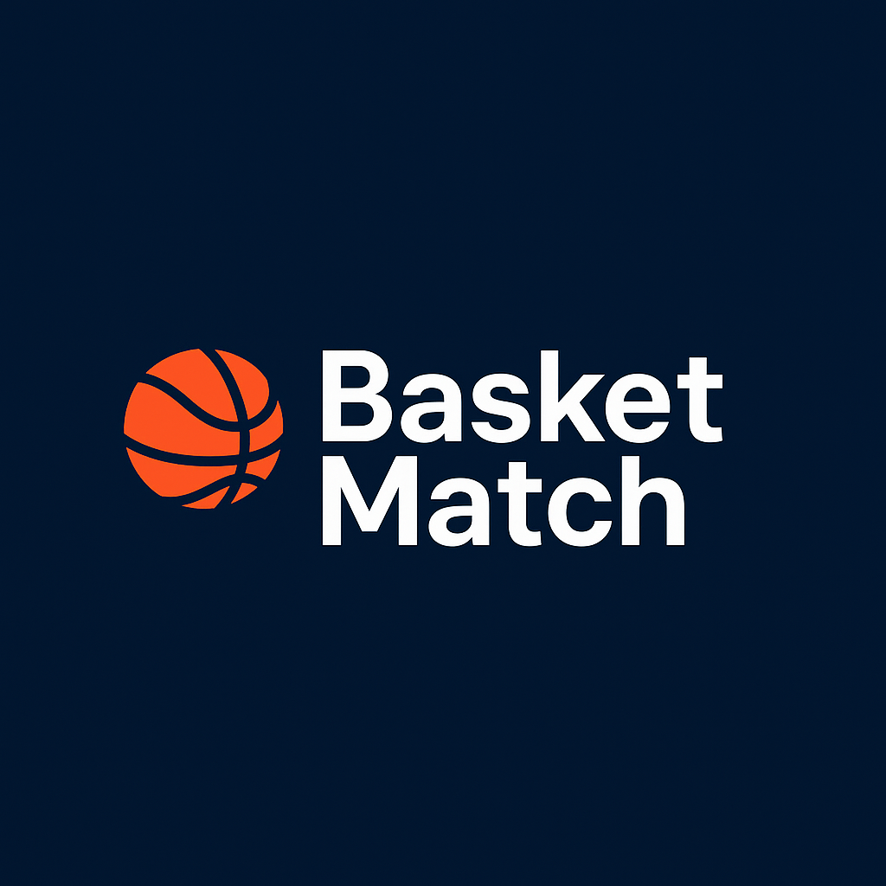

# 🏀 BasketMatch - Feedback Session
## Validando una idea para el básquet amateur en Montevideo

---

## 🤔 ¿Les suena familiar esto?

### Situaciones que vivimos:
- "¿Armamos para el jueves?" → 3 horas de WhatsApp para conseguir 10
- **Trabajo de hormiga**: confirmar uno por uno, reservar cancha, cobrar, etc.
- **Siempre falta uno**: "che, ¿conocés a alguien más?"
- Llegar y que haya 2-3 que juegan en otra liga
- Partidos que se vuelven discusiones en vez de diversión
- Cancelaciones de último momento
- "¿Quién trae la pelota? ¿Y los chalecos?"
- **El que organiza** siempre queda como el denso pidiendo plata

### O si juegan campeonatos:
- **Día fijo** → No podés faltar porque cagás al equipo
- **Plantel de 10** → Jugás 15-20 minutos nada más
- **Temporada completa** → Te comprometés por 3-4 meses
- **Nivel disparejo** → Algunos van muy en serio, otros solo se divierten

### **¿Ustedes han vivido esto? ¿Qué otras situaciones agregarían?**

---

## 💡 La Idea: Un "Netflix del básquet amateur"

### Concepto simple:
- **Pagas una suscripción** → **Jugás cuando querés**
- **Nosotros nos encargamos** de armar el partido
- **Garantizamos** nivel parejo y buen ambiente
- **Incluye** todo: cancha, árbitro, chalecos, pelota

### A diferencia de los campeonatos:
- 🗓️ **Flexibilidad total** - vos elegís cuándo jugar
- ⏱️ **Tiempo de juego garantizado** - partidos 5v5, todos juegan
- 🔄 **Sin compromisos** - jugás cuando podés/querés
- 🎯 **Enfoque en diversión** - ambiente relajado pero competitivo

### Y a diferencia de organizarte vos:
- 🚫 **Cero trabajo organizativo** - no más WhatsApp grupales infinitos
- ✅ **Quorum garantizado** - nunca más "faltan 2"
- 💰 **Sin manejar plata** - no quedás como el denso cobrando
- 📋 **Sin responsabilidades** - solo venís a jugar

### **¿Qué les parece esta propuesta? ¿La usarían?**

---

## 🛠️ ¿Cómo funcionaría?

### Para el jugador:
1. **"Quiero jugar jueves después de las 20h"**
2. Te confirmamos si hay partido
3. Llegás, jugás, te vas
4. **Cero logística, cero organización, cero dolor de cabeza**

### Para nosotros:
1. Juntamos solicitudes
2. Armamos equipos balanceados  
3. Reservamos cancha
4. Mandamos moderador que arbitra
5. **Nos comemos toda la parte tediosa**

### **¿Ven algún problema con este flujo? ¿Qué mejorarían?**

---

## 💰 Modelo de Precios (A VALIDAR)

### Opciones que estamos considerando:
- **Partido suelto**: $350 UYU
- **4 partidos/mes**: $1.200 (15% desc.)
- **8 partidos/mes**: $2.100 (25% desc.)

### **¿Les parece caro/barato? ¿Cuánto pagarían ustedes?**
### **¿Cuántas veces jugarían por mes idealmente?**

---

## 🎯 ¿Quién sería nuestro usuario?

### Nuestras hipótesis:
- Hombres 25-45 años
- Juegan 1-2 veces por semana "idealmente"
- No están en torneos o quieren más flexibilidad
- Priorizan buen ambiente sobre competencia extrema

### **¿Coincide con el perfil que ustedes conocen?**
### **¿Quién más se sumaría a esto?**

---

## 🚀 Plan de Lanzamiento

### Fase 1: Manual (próximos 2-3 meses)
- WhatsApp + Excel para gestionar
- 1-2 partidos por semana
- Grupo inicial de 20-30 jugadores

### Fase 2: Plataforma digital
- App/web simple
- Pagos automáticos
- Ranking de jugadores

### **¿Por dónde empezarían ustedes? ¿Qué les parece el enfoque manual inicial?**

---

## ❓ Preguntas Específicas para Ustedes

1. **¿Cuál es el mayor problema** que ven con los partidos actuales?

2. **¿Quién organiza** en su grupo? ¿Cómo se siente esa persona?

3. **¿Cuánto tiempo les lleva** armar un partido típicamente?

4. **¿Participan o participaron en campeonatos?** ¿Qué les gusta/disgusta?

5. **¿Prefieren flexibilidad vs compromiso fijo?** ¿Por qué?

6. **¿Les molesta jugar pocos minutos** cuando van a un partido?

7. **¿Conocen competencia** directa o indirecta?

8. **¿Qué canchas recomiendan?** (techadas, buen precio, accesibles)

9. **¿A quién más deberíamos hablar** para validar esto?

---

## 🤝 ¿Cómo pueden ayudar?

### Si les gusta la idea:
- **Feedback honesto** sobre precios y concepto
- **Referir contactos** que puedan estar interesados
- **Beta testers** para los primeros partidos
- **Recomendaciones** de canchas/proveedores

### **¿Estarían dispuestos a probar los primeros partidos con descuento?**

---

## 📝 Próximos Pasos

1. **Recolectar feedback** de 10-15 jugadores como ustedes
2. **Ajustar el modelo** basado en lo que escuchemos
3. **Armar grupo piloto** de 20-25 personas
4. **Primer partido test** en julio
5. **Iterar** basado en la experiencia

### **¿Alguna pregunta? ¿Algo que no les cierra?**

---

## 🙏 ¡Gracias!

**Su feedback es clave para que esto funcione**

*¿Les parece que sigamos la conversación con un asado post-partido? 😄*
